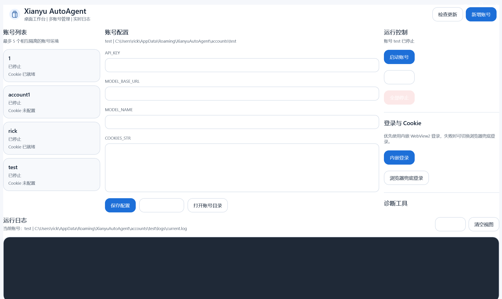

# Xianyu AutoAgent 2.0 - 闲鱼智能客服机器人系统

本项目基于 https://github.com/shaxiu/XianyuAutoAgent 改版。

[](https://www.python.org/) [](https://platform.openai.com/)

专为闲鱼平台打造的 AI 值守方案，支持多专家协同、智能议价、上下文感知对话与自动化回复。

## 主要特性

- 多专家协同与意图路由
- 上下文感知对话与会话记忆
- 议价与技术支持场景处理
- 基础日志输出与运行监控
- GUI 可视化运行、扫码登录与实时日志
- 离线打包（内置 Chrome + chromedriver），安装后可独立运行

## 目录结构

```
.
├─ gui_app.py                # 可视化入口
├─ main.py                   # 服务入口
├─ utils/
│  ├─ env_utils.py            # 离线配置与用户数据目录
│  └─ selenium_login.py       # 扫码登录获取 Cookie
├─ prompts/                   # 提示词模板（自动复制到用户目录）
├─ chrome/                    # 离线浏览器（打包/安装时内置）
├─ chromedriver/              # 离线驱动（打包/安装时内置）
├─ build_exe.ps1              # 单文件 EXE 构建
├─ build_all.ps1              # EXE + 安装包一键构建
└─ installer/inno/setup.iss   # Inno Setup 脚本
```

## 运行与配置（优先使用 Release 最新版）

请优先前往 Release 页面下载最新安装包并使用：  
https://github.com/2836048681/xianyu-autoagent2/releases

安装完成后，通过桌面快捷方式启动即可。

如需源码方式运行（开发/调试用途），再参考下方“环境变量说明”与“离线打包与安装”。

## 多账号并行

支持最多 5 个账号同时运行。每个账号独立 `.env` / `prompts` / `data`，互不影响。  
在界面中新增账号后，配置并启动即可并行运行。

## 环境变量说明

必填：
- `API_KEY`：模型平台 API Key
- `COOKIES_STR`：闲鱼 Web Cookie（可通过 GUI 扫码获取）

可选：
- `MODEL_BASE_URL`：模型服务地址，默认 `https://dashscope.aliyuncs.com/compatible-mode/v1`
- `MODEL_NAME`：模型名称，默认 `qwen-max`
- `TOGGLE_KEYWORDS`：人工接管切换关键字，默认 `。`
- `SIMULATE_HUMAN_TYPING`：模拟人工输入延迟，默认 `False`
- `HEARTBEAT_INTERVAL` / `HEARTBEAT_TIMEOUT`
- `TOKEN_REFRESH_INTERVAL` / `TOKEN_RETRY_INTERVAL`
- `MANUAL_MODE_TIMEOUT`
- `MESSAGE_EXPIRE_TIME`

## 离线打包与安装（Windows）

### 1. 准备离线 Chrome

将离线浏览器放到仓库根目录：

```
chrome\chrome.exe
chromedriver\chromedriver.exe
```

### 2. 构建单文件 EXE

```powershell
.\build_exe.ps1
```

产物：
```
dist\v1.exe
```

### 3. 生成安装包（Inno Setup）

```powershell
.\build_all.ps1
```

产物：
```
installer\inno\Output\XianyuAutoAgent_0.1_Setup.exe
```

安装特性：
- 安装目录默认 `D:\rickxy`
- 内置 `chrome` / `chromedriver`
- 可选创建桌面快捷方式
- 可选开机自启

## 用户数据与离线运行

运行后自动生成用户目录：

```
%APPDATA%\XianyuAutoAgent
```

其中包含：
- `.env`（配置文件）
- `prompts/`（自动复制模板）
- `data/`（会话数据库）

因此 EXE 或安装包可单独运行，不要求同级目录放置 `.env` 或 `prompts`。

## 提示词模板

`prompts` 目录内包含：

- `classify_prompt.txt`
- `price_prompt.txt`
- `tech_prompt.txt`
- `default_prompt.txt`

首次运行会自动复制到用户目录，可在用户目录中修改模板。

## Release 说明（v0.1）

主要更新：
- 新增 GUI 可视化控制台（扫码登录、配置管理、实时日志）
- 支持离线登录与 Cookie 自动更新（内置 Chrome + chromedriver）
- 单文件 `v1.exe` 与 Inno Setup 安装包
- 用户数据独立存储于 `%APPDATA%\XianyuAutoAgent`
- 一键构建脚本 `build_exe.ps1` / `build_all.ps1`

## 界面预览



已知限制：
- 当前仅提供 Windows 64 位离线包
- 首次启动需要配置模型 API

## 贡献

欢迎提交 Issue 或 PR。

## 免责声明

本项目仅供学习交流使用，若涉及侵权请联系作者删除。
